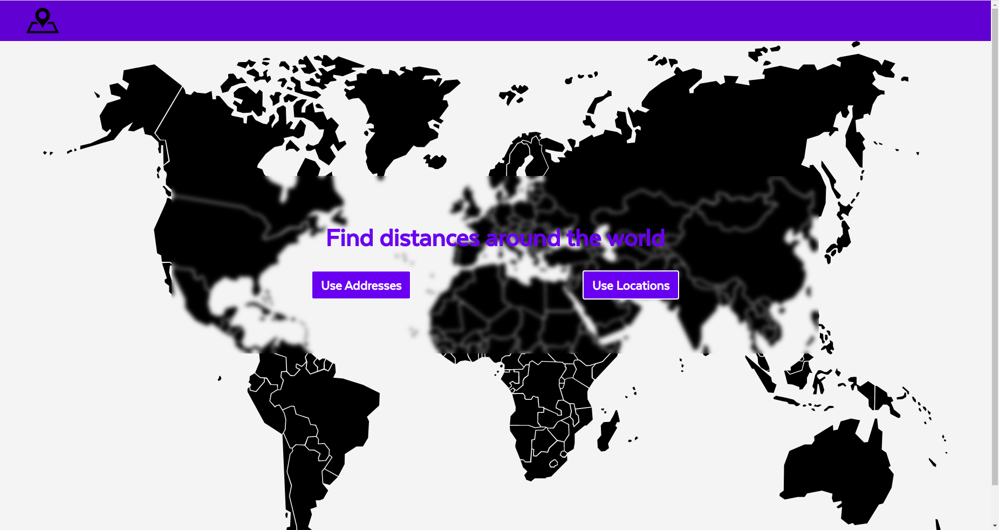

# Geocoding API

[](https://circleci.com/gh/raparicio6/geocoding-node)



## Getting Started

### Installing node

Get the latest version of node from the [official website](https://nodejs.org/) or using [nvm](https://github.com/creationix/nvm).  
Nvm approach is preferred.

Install dependencies by running `npm i`.

Create a *.env* file at the root of the project and add:  
`GOOGLE_GEOCODING_API_KEY=<your Google Geocoding API key>`

**This project has its corresponding [Frontend](https://github.com/raparicio6/geocoding-react).**

### Starting app

We have two ways to start the app. To start it in production mode run `npm start` in the root path of the project. To start it in development mode (nodemon) run `npm run start-dev`. Then access the app at **localhost:port**. The port is logged in the console where you run the start script.  
Also, you can start the app in production mode using [docker](https://www.docker.com/get-started).

## Development

### Environments

By default, the environment will be **development**, but you can easily change it using the **NODE_ENV** environmental variable.

### Environment variables

[Dotenv](https://www.npmjs.com/package/dotenv) is used for managing environment variables. They are stored in the `/.env` file. Take into account that the variables defined in the `bashrc` are not overrided.

The environment variables should be added to the `.env` file in the form of `NAME=VALUE`, as the following example:

```
PORT=8081
```

**Remember not to push nor commit the `.env` file.**

### Testing

In order to execute the tests run `npm test`.  
[Jest](https://jestjs.io/) was used as the testing framework.

## Built With

* [Express.js](https://expressjs.com/)
* [CircleCI](https://circleci.com/)

## Contributing

1. Fork it
2. Create your feature branch (`git checkout -b my-new-feature`)
3. Run the tests (`npm test`)
4. Commit your changes (`git commit -am 'Add some feature'`)
5. Push to the branch (`git push origin my-new-feature`)
6. Create new Pull Request

## About

This project was written and is maintained by [Rodrigo Aparicio](https://github.com/raparicio6).
